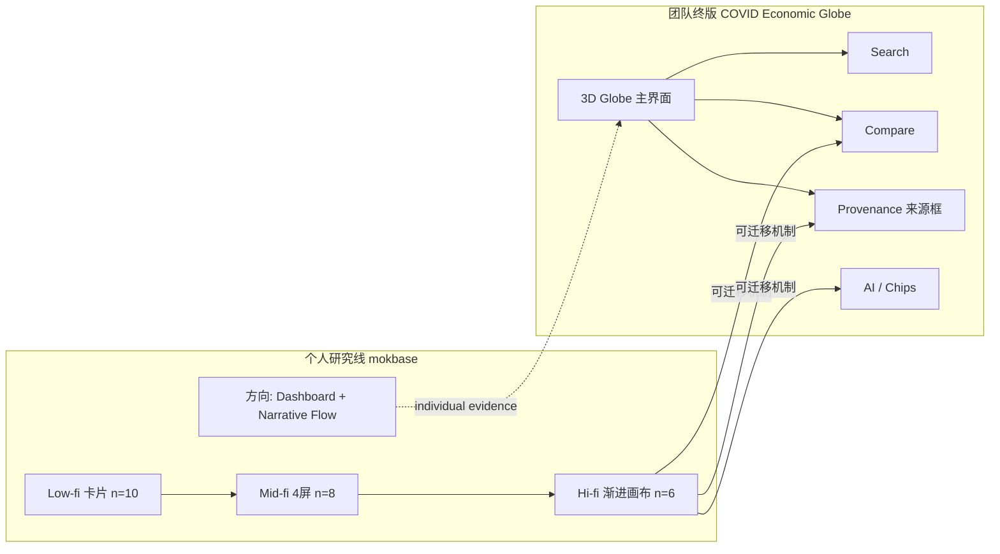

# 团队方案 vs 个人迭代（如何同场不矛盾）

## 一张图看懂两条线

---

## 关键分歧与整合叙事（必背）

> **Weekly W12 Q1** 书面记录：你选 **Path B**（interpretation-first guided comparison + narrative flow），**拒绝** globe-first 作为主验证仪器；团队 5.8 仍保留地球。面试必须会讲这条「有证据的折衷」。

| 维度 | 个人 mokbase_v1 + **W12** | 团队 5.8 决策 | 你怎么讲 |
| --- | --- | --- | --- |
| 主界面 | Path B；globe **非**主研究仪器 | **保留** 地球 | W12：W6 只有导航数据、W8 偏好≠理解；地球=where，解读=面板/对比/来源」 |
| 结构 | Guided dashboard + 叙事流 | Globe + 侧栏/对比/来源 | 「个人线验证机制；团队线验证集成」 |
| 测试数据 | 你的三轮 n=10/8/6 | 团队可能另有测试 | 分开说样本；机制可共享 |

---

## 一句话整合（英文）

> Personal iteration showed that **engagement without interpretation scaffolding fails**; the team kept the globe for spatial entry and adopted **comparison, provenance, and inline semantics** that my hi-fi round had already validated.

## 一句话整合（中文）

> 个人迭代证明：**只有参与感不够**；团队保留地球作空间入口，并吸收我高保真里验证过的**对比、来源与就地语义**机制。

---

## 若考官追问「那你是不是不同意团队？」

**不要**说团队错了。推荐：

1. 承认 globe-first 的风险（你的测试 + `prototype_direction_decision.md`）。  
2. 说明 5.8 是 **design trade-off**：展示吸引力、组员技能栈、统一交付。  
3. 强调你用 **来源+对比** 把风险压住——这正是 tutor 要的「有依据的折衷」。

---

## Individual iteration 在评分里的价值

- 证明你个人走完 **RQ → test → synthesis → design decision**（hurdle：Design Rationale Capture）。  
- 展示 **critical reflection**：能质疑 globe，仍能在团队约束下交付。  
- 文献与 plan 文件夹支撑 **学术论证**，不只靠直觉。

---

## 文件对照：个人决策 vs 团队会议

| 主题 | 个人文档 | 团队文档 |
| --- | --- | --- |
| 放弃/保留 globe | `mokbase_v1/prototype_direction_decision.md` | `5.8meeting/meeting-summary.md` |
| 最终 hi-fi 架构 | `mokbase_v3/prototype_direction_decision.md` | 根目录 `src/` |
| 测试进团队功能 | `Re/result.md` §2 | 本文件夹 `03`、`04` |
